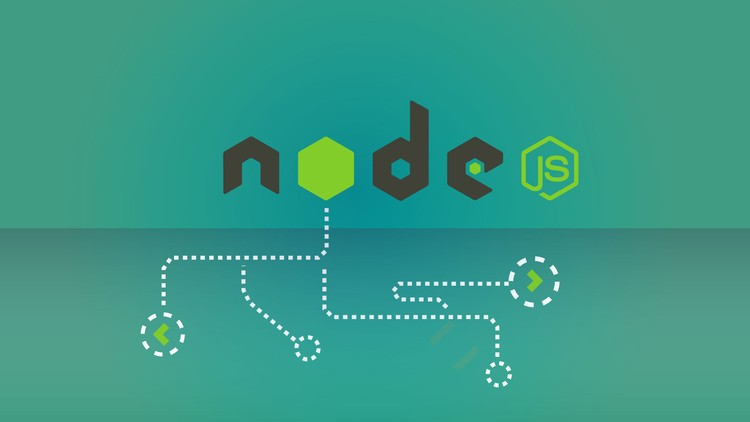

# NodeJS Example Restful API 
:computer: Example Restful API: NodeJS, Express, PostgreSQL, Sequelize, Travis, Mocha, Coveralls and Code Climate.




## Containers included:

- Mailhog (Custom from Skilldlabs Company) [Mailhog](https://hub.docker.com/r/skilldlabs/mailhog)
- MySQL 5.7 [mysql:5.7](https://hub.docker.com/_/mysql)
- Redis 5.0 [bitnami/redis:5.0](https://hub.docker.com/r/bitnami/redis/)
- Postgres [latest](https://hub.docker.com/_/postgres)
- Golang [latest](https://hub.docker.com/_/golang)
- NodeJS: 8.9.3
------

## The first of all:
##### Install Docker:
- On Linux Ubuntu/Debian:
  https://docs.docker.com/install/linux/docker-ce/ubuntu/ 
  https://docs.docker.com/install/linux/docker-ce/debian/

- On MacOS:
  https://docs.docker.com/docker-for-mac/install/

- On Windows:
  https://docs.docker.com/docker-for-windows/install/

##### Install Docker Compose:
- https://docs.docker.com/compose/install/

##### Download repository:

```
git clone git@github.com:eneus/ExampleNodeJSRestFullAPI.git
```

##### Go to downloaded folder:

```
cd ExampleNodeJSRestFullAPI
```

##### Configure your .env file:

```
COMPOSE_FILE=./docker/docker-compose.yml
COMPOSE_PROJECT_NAME=nodejsex
c=books
DB_USER=books
DB_PASS=books
DB_PORT=5432
DB_HOST=127.0.0.1
SECRET_KEY=any_secrets

IPRANGE=172.10.10.0/16
CUID=1000
CGID=1000

```

##### Start docker container via Makefile:

```
$ make all
```

##### Start docker container via docker-compose:

```
docker-compose up
or
docker-compose up -d     //in background
```

##### Now you can access to you static site:

Example FullREST API link: http://localhost:8080/
